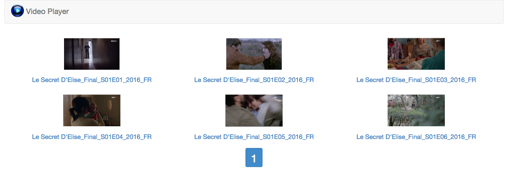
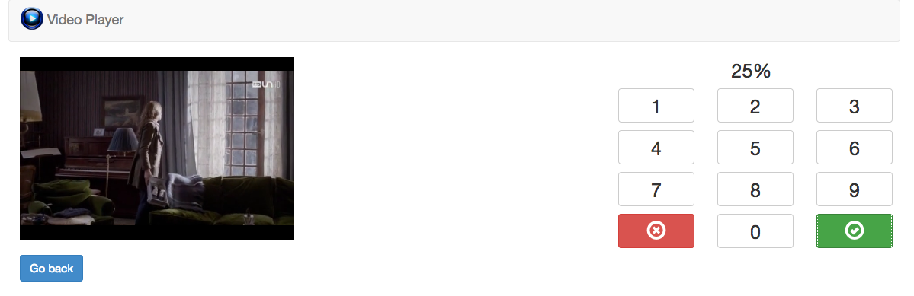

Touchscreen Video Player
========================

## What is it?

I'm in a sport club providing LifeFitness equipment. Each machine
incorporate a tablet, offering TV, a few apps, some sports-related 
things and... an Internet browser. For me it meant, "an online video
player" that will play my favorite movies.





Those machines do not store any cookie, and I was too lazy to 
create a query string based session id; so security is only based 
on an ip whitelist.

If you are not whitelisted yet, you'll end up on a page only containing
your ip address instead of videos; use a terminal on your phone to
whitelist yourself. Available commands are:

```sh
-- add an ip address
php app/console ip:add <your ip>

-- remove an ip address
php app/console ip:remove <ip>

-- list whitelisted ips
php app/console ip:list
```

Once "logged in", you can access videos stored in your server's 
directory. It supports mp4, but prefer a big compression to avoid
latency (internet connection isn't always good), such as:

```sh
ffmpeg -i originalMovie.avi -c:v libx264 -crf 24 -preset slow -c:a aac -strict experimental -b:a 192k -ac 2 lifefitnessMovie.mp4
```

This is quite minimal but does the job for me. Note that both my flat
and my club use fiber, I never tested this website on slower connections
(except using my 4G phone at a hotel).

## Supported languages

- English
- Français

## Installation

First, install the application:

```sh
php -r "readfile('https://getcomposer.org/installer');" | php
php composer.phar update
php app/console assets:install web --symlink
php app/console doctrine:schema:create
php app/console server:start
run http://127.0.0.1:8000
```

Now, move your videos to the `web/videos` directory. If you wish not
to move them, create a symbolic link (don't forget to disable
directory indexing in your server configuration, or at least put an
index.html inside the exposed video directory).

*Note*

If you want movie thumbnails, you need to install ffmpeg on your server, and allow php to exec(). That's
not mandatory though, you'll just have a fallback image instead.

## Bonus

Encode your whole *.avi movies to compatible video.js .mp4 files with the following command (requires ffmpeg):

```sh
php app/console prepare:videos
```

Create .png thumbnails for a more friendly index (requires ffmpeg):

```sh
php app/console prepare:thumbnails
```

Create animated .gif to ~~feel like on youporn~~ have an AWESOME index
(requires ffmpeg and convert):

```sh
php app/console prepare:animated-thumbnails
```

## License

- This project is released under the MIT license

